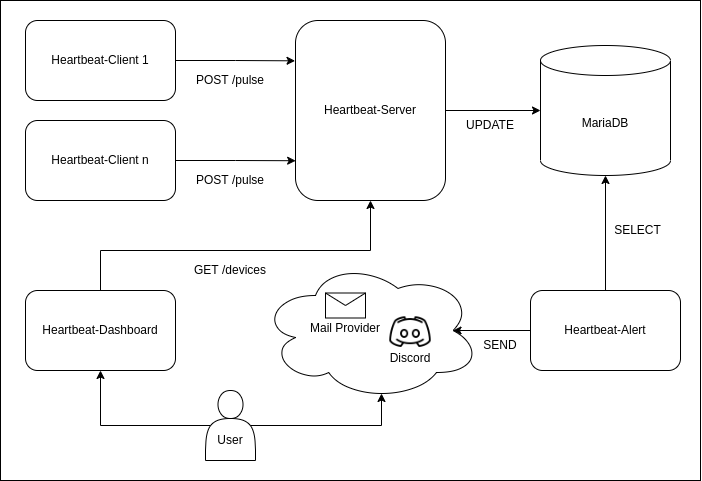

# Heartbeat Local Development Environment

This is a local setup for all components of the heartbeat project.

## Components

[Heartbeat-Client](https://github.com/LuisNaldo7/heartbeat-client)

[Heartbeat-Server](https://github.com/LuisNaldo7/heartbeat-server)

[Heartbeat-Alert](https://github.com/LuisNaldo7/heartbeat-alert)

[Heartbeat-Dashboard](https://github.com/LuisNaldo7/heartbeat-dashboard)



## Run

Copy .env.example to .env and adjust values.

start containers
```bash
docker-compose up -d
```

stop containers
```bash
docker-compose down
```

## Dashboard

Visit http://localhost/ to get an overview of registered clients and their latest states.

## Trigger Alert Mail

stop execution of any heartbeat-client
```bash
docker stop client-1
```

alert mail will be sent after max_timeout exceeds

## Managing Database

Visit http://localhost:8080/ to view admin frontend. Credentials are defined in service "database" of docker-compose.yml